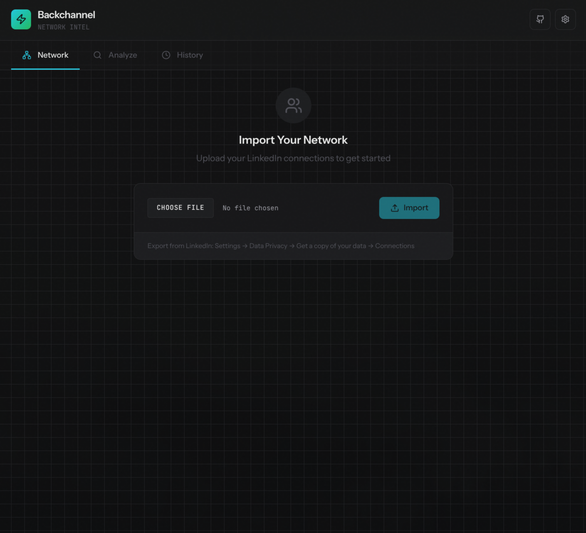

# Backchannel

Find out who in your network has worked with a job candidate before you reach out for a reference.

## The problem

You're evaluating a candidate and want to do a backchannel reference. But cross-referencing their work history against your 500+ LinkedIn connections by hand? That takes hours.

Backchannel automates this. Import your connections, paste a candidate's LinkedIn URL, and see which colleagues overlapped with them at the same companies.

The intended use: filter for your current coworkers to find out if any of them worked with the candidate before. That's your shortlist for a warm, trusted reference.



## Features

- Import your LinkedIn connections (CSV export)
- Fetch work history for your network
- Paste a candidate's LinkedIn URL to analyze
- See colleagues who worked at the same companies at the same time
- Draft outreach emails

## Quick start

```bash
# Install Bun if you haven't: https://bun.sh
curl -fsSL https://bun.sh/install | bash

# Clone and setup
git clone https://github.com/hirefrank/backchannel.git
cd backchannel
bun install
bun run db:migrate
bun run dev
```

Open [http://localhost:3000](http://localhost:3000)

### Configuration

1. Click the Settings gear icon and change the company name to your current employer (defaults to Shopify)
2. Add your LinkedIn session cookie (see below)
3. Add a Gemini API key from [Google AI Studio](https://aistudio.google.com/apikey)

### Getting your LinkedIn session cookie

1. Open [linkedin.com](https://www.linkedin.com) in Chrome and log in
2. Open DevTools: `F12` (or `Cmd+Option+I` on Mac)
3. Go to Application tab, then Cookies, then linkedin.com
4. Find the cookie named `li_at`
5. Double-click the Value column and copy the entire string
6. Paste it into Backchannel's Settings

The cookie looks like `AQEDAT...` (a long alphanumeric string). Treat it like a password.

### Usage

1. Export connections from LinkedIn (Settings → Data Privacy → Get a copy → Connections)
2. Import the CSV in the Network tab
3. Click "Enrich All" to fetch work histories
4. Go to the Check tab, paste a candidate's LinkedIn URL
5. See who in your network worked with them

## Tech stack

[Bun](https://bun.sh) + [Hono](https://hono.dev) + [Vite](https://vitejs.dev) + [React](https://react.dev) + SQLite + [Puppeteer](https://pptr.dev) + [Gemini AI](https://ai.google.dev)

## How it works

```
┌─────────────────────────────────────────────────────────────┐
│  Your Browser                                               │
│  ┌─────────────┐  ┌──────────────┐  ┌─────────────────┐   │
│  │   Network   │  │    Check     │  │     History     │   │
│  │  Import CSV │  │  Find overlaps│  │  Past searches  │   │
│  └─────────────┘  └──────────────┘  └─────────────────┘   │
└─────────────────────────────────────────────────────────────┘
                            │
                            ▼
┌─────────────────────────────────────────────────────────────┐
│  Local Server (localhost:3000)                              │
│  ┌──────────┐  ┌──────────────┐  ┌────────────────────┐   │
│  │  SQLite  │  │  Puppeteer   │  │    Gemini AI       │   │
│  │  (local) │  │  (your session)│ │  (parse profiles)  │   │
│  └──────────┘  └──────────────┘  └────────────────────┘   │
└─────────────────────────────────────────────────────────────┘
```

## On "scraping"

This isn't scraping in the usual sense.

Traditional scraping uses fake accounts to harvest data from profiles you can't access, at scale, for commercial use. Backchannel uses your own authenticated session to view profiles you already have access to, stores everything locally, and automates what you'd otherwise do by clicking around manually.

Think of it like a password manager auto-filling forms, or an email client fetching messages. You're not bypassing access controls. You're just automating your own workflow.

That said, LinkedIn's Terms of Service are broad enough that they could object to any automation. Keep rate limits reasonable (default is 2 seconds between requests), use it for personal reference checks, don't redistribute data, and understand you're on your own here.

## Project structure

```
backchannel/
├── client/                 # React frontend
│   └── src/
│       ├── components/     # UI components
│       └── lib/            # API client
├── server/                 # Hono backend
│   └── src/
│       ├── db/             # SQLite schema
│       ├── lib/            # LinkedIn automation, AI parsing
│       └── routes/         # API endpoints
└── network.db              # Local database (gitignored)
```

## Security

Your session cookie and API key are stored in local SQLite. The database file is gitignored and never committed.

One thing to know: profile text gets sent to Google's Gemini API for parsing into structured data. Everything else stays on your machine.

If you think your session cookie is compromised, revoke it in LinkedIn's settings.

## Development

```bash
bun run dev          # Start server (serves pre-built client)
bun run dev:dual     # Start both with HMR
bun run build        # Build client for production
bun test server/src  # Run tests
```

## Background

This project was inspired by a similar feature in Google's internal ATS (Applicant Tracking System) circa 2006, which surfaced coworker overlaps with candidates automatically.

## License

MIT
